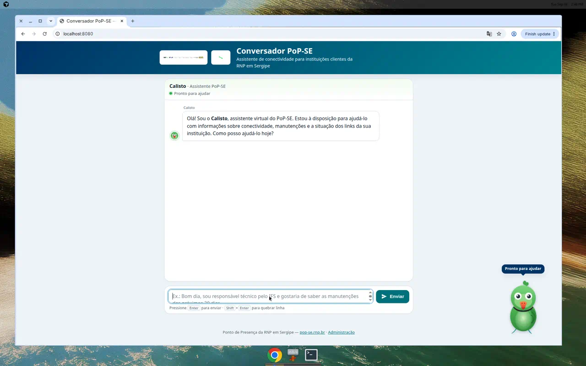
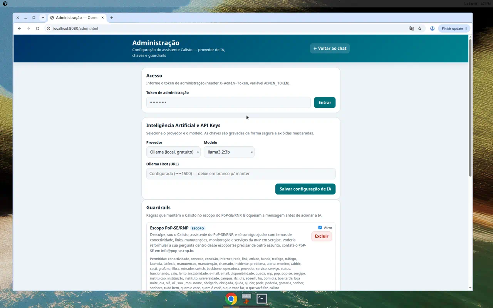
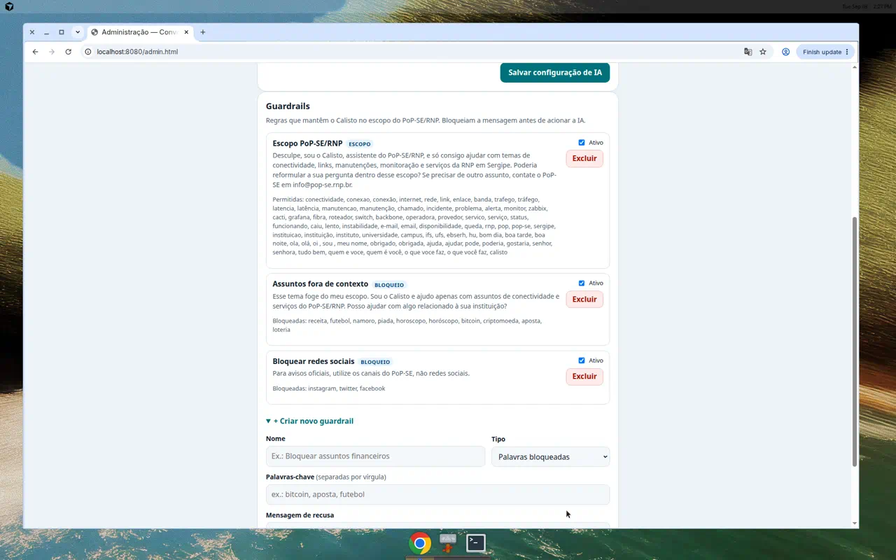
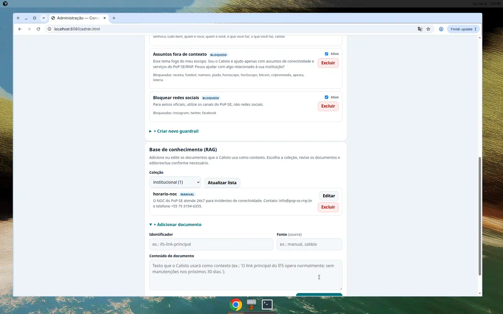

# Conversador PoP-SE

## Repositório

**https://github.com/avilarezende/conversador-pop-se**

[](https://github.com/avilarezende/conversador-pop-se/actions/workflows/ci.yml)

Assistente virtual modular do **Ponto de Presença da RNP em Sergipe (PoP-SE)** para clientes de conectividade — instituições de ensino, pesquisa e saúde. O assistente se chama **Calisto** (mascote papagaio ring-neck verde).

O bot consulta fontes operacionais (Zabbix, Cacti, Grafana, e-mail Microsoft) e contexto institucional via RAG, mantém memória persistente dos usuários e responde de forma **polida, educada e solícita** sobre status de links, manutenções programadas e situação com operadoras. **Guardrails** mantêm o Calisto restrito ao escopo do PoP-SE/RNP.

**Principais recursos:** chat web com o mascote **Calisto** (avatar flutuante animado) · **guardrails** de escopo · **painel de administração** (`/admin.html`) para escolher IA/modelo/API keys, criar guardrails e gerenciar a base de conhecimento (RAG) · canais opcionais (WhatsApp, Telegram, Discord) · IA local (Ollama) ou remota (Gemini, OpenAI, Azure, Grok) · Docker modular · CI/CD com GitHub Actions.



---

## Guia rápido: subir o chatbot

### 1. Pré-requisitos

- [Docker](https://docs.docker.com/get-docker/) e Docker Compose v2
- Git

### 2. Clonar e configurar

```bash
git clone https://github.com/avilarezende/conversador-pop-se.git
cd conversador-pop-se
cp .env.example .env
```

### 3. Preencher o `.env`

| Variável | Obrigatório | O que colocar |
|----------|-------------|---------------|
| `POSTGRES_PASSWORD` | Sim | Senha forte para o banco |
| `LLM_PROVIDER` | Sim | `ollama` (gratuito local) ou `gemini` / `openai` / `azure` / `grok` |
| `GEMINI_API_KEY` | Se usar Gemini | Chave em [Google AI Studio](https://aistudio.google.com/apikey) |
| `GEMINI_MODEL` | Opcional | Modelo Gemini (padrão `gemini-flash-latest`) |
| `OPENAI_API_KEY` | Se usar OpenAI | Chave em [platform.openai.com](https://platform.openai.com/api-keys) |
| `ADMIN_TOKEN` | Sim | Token do painel de administração (`/admin.html`). **Altere** o padrão `popse-admin` |
| `ZABBIX_URL`, `ZABBIX_USER`, `ZABBIX_PASSWORD` | Para monitoração | Credenciais do Zabbix do PoP-SE |
| `CACTI_*`, `GRAFANA_*` | Opcional | Credenciais das ferramentas de monitoração |

> Dica: o provedor de IA, as API keys, os guardrails e a base RAG também podem ser configurados sem editar o `.env`, pelo painel de administração em `/admin.html`.

> Guia completo: [docs/CONFIGURATION.md](docs/CONFIGURATION.md)

### 4. Preencher `config/clients.yaml`

Cadastre as instituições clientes e os links monitorados:

```yaml
instituicoes:
  - sigla: IFS
    nome: "Instituto Federal de Sergipe"
    aliases: ["IFS", "IF Sergipe"]
    links_monitorados:
      - id: ifs-principal
        zabbix_host: "ifs-link-principal"   # nome do host no Zabbix
```

### 5. Ativar módulos em `config/modules.yaml`

```yaml
fontes_rag:
  zabbix:
    enabled: true    # mude para true quando ZABBIX_* estiver no .env
  popse_site:
    enabled: true    # contexto do site pop-se.rnp.br
```

### 6. Subir os containers

```bash
# Núcleo: web + engine + postgres + ollama
docker compose --profile core up -d --build

# Baixar modelo de IA (primeira vez, ~2 GB)
docker compose exec ollama ollama pull llama3.2:3b

# Coletores de monitoração (opcional)
docker compose --profile sources up -d --build
```

Acesse o chat: **http://localhost:8080** · Administração: **http://localhost:8080/admin.html**

### 7. Verificar saúde

```bash
curl http://localhost:8000/health
# {"status":"ok","service":"conversador-engine","llm_provider":"ollama"}
```

---

## Painel de administração (`/admin.html`)

Protegido por token (`ADMIN_TOKEN`, enviado no header `X-Admin-Token`). Permite, sem editar o `.env` nem reiniciar containers:

- **Inteligência Artificial e API Keys**: escolher o provedor e o modelo (Ollama, Gemini, OpenAI, Azure, Grok — já pré-configurados) e informar as credenciais (gravadas com segurança e exibidas mascaradas).
- **Guardrails**: criar, ativar/desativar e excluir regras que mantêm o Calisto no escopo do PoP-SE/RNP.
- **Base de conhecimento (RAG)**: adicionar, editar e excluir documentos das coleções `operacional`, `institucional` e `manutencoes`.

| IA e API Keys | Guardrails | Base de conhecimento (RAG) |
|---|---|---|
|  |  |  |

## Funcionalidades

- Chat web com o mascote **Calisto** (avatar flutuante animado) e logos oficiais PoP-SE/RNP
- **Guardrails** de escopo: recusa educada de assuntos fora do PoP-SE/RNP
- **Administração** de IA/API keys, guardrails e base de conhecimento (RAG)
- Memória persistente: nome, instituição, preferências, contatos
- RAG: Zabbix, Cacti, Grafana, e-mail Microsoft, site PoP-SE
- Canais modulares: WhatsApp, Telegram, Discord
- IA: Ollama (local) ou Gemini / OpenAI / Azure / Grok (remoto)
- CI/CD: lint, testes, build Docker, imagens no GHCR

## Perfis Docker

```bash
docker compose --profile core up -d          # núcleo
docker compose --profile sources up -d       # coletores Zabbix/Cacti/Grafana
docker compose --profile email up -d         # e-mail Microsoft 365
docker compose --profile telegram up -d      # bot Telegram
docker compose --profile discord up -d       # bot Discord
docker compose --profile whatsapp up -d      # WhatsApp webhook
```

## Exemplo de conversa

> **Usuário:** Bom dia, sou Rodrigo. Sou responsável técnico pelo IFS e gostaria de saber as manutenções dos próximos 30 dias.

> **Calisto:** Bom dia, senhor Rodrigo. Confirmo o vínculo com o IFS — Instituto Federal de Sergipe. Consultei as fontes disponíveis e...

> **Usuário:** Me conta uma piada?

> **Calisto:** Esse tema foge do meu escopo. Sou o Calisto e ajudo apenas com assuntos de conectividade e serviços do PoP-SE/RNP. Posso ajudar com algo relacionado à sua instituição? *(resposta acionada por um guardrail)*

## Estrutura

```
config/           # clientes, módulos, fontes (YAML comentados)
services/
  engine/         # FastAPI — chat, RAG, memória, LLM
    app/
      guardrails.py     # guardrails de escopo PoP-SE/RNP
      settings_store.py # persistência de IA/guardrails (administração)
      routers/admin.py  # API de administração (IA, guardrails, RAG)
  web/            # Apache + interface de chat (index.html) e admin (admin.html)
  modules/        # canais e integrações
docs/             # arquitetura, configuração, CI/CD (+ img/)
```

## Documentação

| Documento | Conteúdo |
|-----------|----------|
| [CONFIGURATION.md](docs/CONFIGURATION.md) | Todas as variáveis e arquivos YAML |
| [ARCHITECTURE.md](docs/ARCHITECTURE.md) | Arquitetura de containers |
| [MODULES.md](docs/MODULES.md) | Canais e fontes RAG |
| [CI_CD.md](docs/CI_CD.md) | Pipelines GitHub Actions |
| [CONTRIBUTING.md](CONTRIBUTING.md) | Como contribuir |

## Contato PoP-SE

- Site: https://www.pop-se.rnp.br
- E-mail: info@pop-se.rnp.br
- Telefone: +55 79 3194-6355
