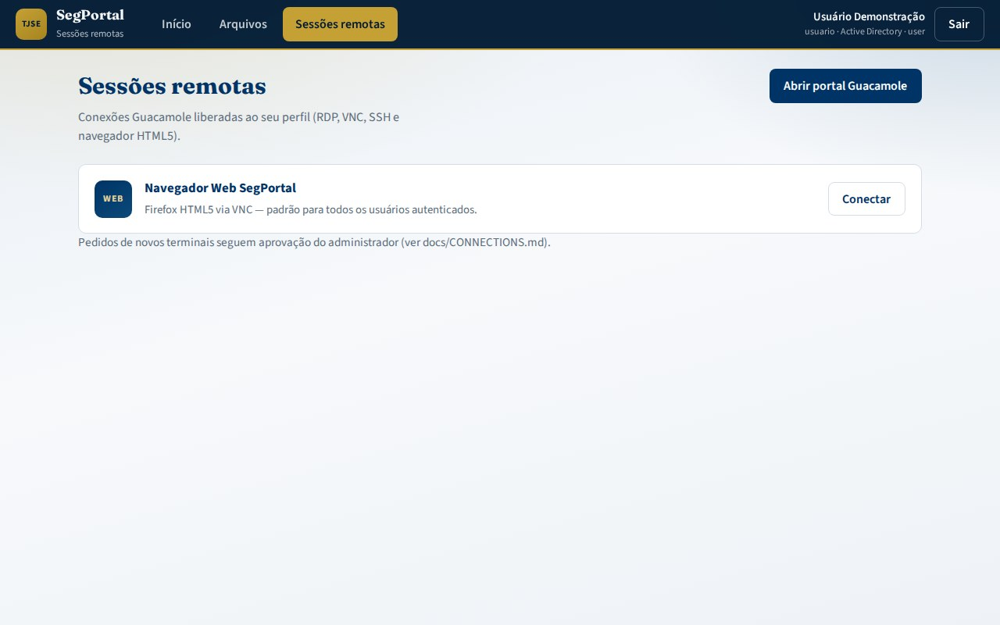

# Manual do administrador — SegPortal AQNE

Operação, configuração e suporte do SegPortal: autenticação, pastas AD, nuvem, conexões SegPortal e papéis.

Documentos técnicos: [CONFIGURATION.md](CONFIGURATION.md) · [LOCAL_ADMIN.md](LOCAL_ADMIN.md) · [ROLES.md](ROLES.md) · [CONNECTIONS.md](CONNECTIONS.md) · [FILES.md](FILES.md) · [DEPLOYMENT.md](DEPLOYMENT.md).

---

## 1. Visão dos componentes

| Serviço | Porta | Função |
|---------|-------|--------|
| **portal-auth** | **8090** | Dashboard, AD/nuvem, navegador/proxy, computadores, admin, lembretes/calendário |
| **sessions** | **8080** | Sessões RDP/VNC/SSH/navegador HTML5 |
| **guacd** | 4822 | Proxy de protocolos |
| **postgres** | 5432 | Metadados SegPortal |
| **web-browser** | 5900 | Firefox via VNC (navegador padrão) |
| **proxy-egress** | 3128 | Saída HTTP com IP institucional |
| **segportal-bootstrap** | job | Schema, papéis, conexão padrão |


---

## 2. Contas e autenticação

### 2.1 Contas demo / emergência

| Usuário | Senha inicial | Papel |
|---------|---------------|-------|
| `admin` | `admin` | admin (portal-auth + SegPortal) |
| `usuario` | `usuario` | user |

> Em produção: troque a senha do `admin` no primeiro acesso. Ver [LOCAL_ADMIN.md](LOCAL_ADMIN.md).

### 2.2 Active Directory / LDAP

1. Configure `config/ldap/ldap-settings.yaml` e variáveis `LDAP_*` no `.env`.
2. `LDAP_ENABLED=true` no SegPortal e no portal-auth.
3. No login do portal (`:8090`), o usuário pode marcar **Active Directory** para forçar o contexto LDAP mesmo em demo.

Atributos usados para pastas (`config/files/shares.yaml`):

| Atributo AD | Uso |
|-------------|-----|
| `homeDirectory` | UNC do home |
| `homeDrive` | Letra (ex.: H:) |
| `profilePath` | Perfil roaming (referência) |
| `extensionAttribute10` | Shares extras (opcional) |

### 2.3 MFA (RADIUS)

Opcional no SegPortal (`MFA_ENABLED`, `MFA_RADIUS_*`). Não bloqueia o portal-auth em modo demo.

---

## 3. Arquivos, AD e nuvem (portal-auth)


### 3.1 Configuração

Arquivo: [`config/files/shares.yaml`](../config/files/shares.yaml)

- `shares.corporate` — pastas departamentais/públicas
- `shares.demo` — árvore local para laboratório (`DEMO_SHARES_ROOT`)
- `cloud_drives.onedrive` / `google_drive` — `client_id` vazio = **modo demo**

Variáveis de ambiente relevantes:

| Variável | Padrão | Função |
|----------|--------|--------|
| `PORTAL_SESSION_SECRET` | (dev) | Assinatura do cookie de sessão |
| `DEMO_SHARES_ROOT` | `/data/shares` | Raiz das pastas demo |
| `SESSIONS_INTERNAL_URL` | `http://localhost:8090` | reservado (sessões embutidas no portal) |
| `LDAP_ENABLED` | `false` | Contexto AD no portal |
| `PORTAL_MAX_UPLOAD_MB` | `100` | Limite de upload |

### 3.2 Operação diária

| Tarefa | Como |
|--------|------|
| Liberar pasta corporativa | Incluir em `shares.corporate` e/ou grupo AD; redeploy/config reload |
| Habilitar OAuth real | Preencher `client_id` (e tenant OneDrive) em `shares.yaml` |
| Auditar uso | Logs do container `portal-auth`; health em `GET /api/health` |
| Reset demo | Apagar volume `portal-shares` / diretório `DEMO_SHARES_ROOT` |

### 3.3 API útil

| Método | Rota |
|--------|------|
| `GET` | `/api/health` |
| `POST` | `/api/login` (`use_active_directory`) |
| `GET` | `/api/dashboard` |
| `GET/POST/DELETE` | `/api/files/{share_id}` … |
| `POST` | `/api/cloud/{provider}/mount` |
| `GET` | `/api/computers` |
| `GET/POST/PATCH/DELETE` | `/api/admin/computers` … |
| `GET` | `/api/admin/users` |
| `GET/PUT` | `/api/admin/proxy-policy` |
| `GET` | `/api/proxy-policy` (resumo) |
| `GET` | `/api/browser/proxy?url=` |

---

## 4. Administração no portal (UI)

A aba **Administração** aparece apenas para `role=admin`.


### 4.1 Política de proxy (navegador embutido)

Persistência: `{DEMO_SHARES_ROOT}/proxy_policy.json`.

| Campo | Função |
|-------|--------|
| **Modo** | `allowlist` (padrão), `blocklist` ou `allow_all` |
| **Domínios / prefixos permitidos** | Destinos liberados na allowlist |
| **Domínios / prefixos / palavras filtrados** | Bloqueio explícito |
| **Modo de exceções** | `disabled`, `per_user` (local/AD) ou `open` |
| **Exceções** | Domínios extras + assignees + validade |
| **Horários** | Dias, início/fim, timezone e ação fora da janela |
| **Bypass admin** | Administradores ignoram filtros (opcional) |

A política é aplicada em `GET /api/browser/proxy` **antes** do fetch. O Squid (`proxy-egress`) continua sendo o gate de egress do Firefox/VNC.

### 4.2 Computadores e alocação


1. Informe título, protocolo (RDP/VNC/SSH/navegador), host/porta e descrição.
2. Selecione usuários **locais** ou **AD** (ou inclua um sAMAccountName adicional).
3. **Criar acesso** — o usuário passa a ver o item em **Computadores**.
4. Use **Alocar** / **Excluir** na tabela (acessos builtin não são excluídos).

Persistência: `{DEMO_SHARES_ROOT}/computers.json`.

---

## 5. Sessões remotas e navegador padrão



1. No boot, `web-browser` sobe o Firefox/VNC e `segportal-bootstrap` cria **Navegador Web SegPortal** com permissão de leitura para todos.
2. Senha VNC deve coincidir com o parâmetro da conexão SQL (`VNC_PASSWORD`, padrão demo `segport1`).
3. Pedidos de RDP/VNC/SSH: usuário solicita → admin aprova.

```bash
./scripts/request-connection.sh usuario "RDP App X" rdp 10.10.20.10 3389 "Motivo"
./scripts/approve-connection-request.sh 1
```

Painel conceitual de aprovações:


Detalhes: [CONNECTIONS.md](CONNECTIONS.md) · [ROLES.md](ROLES.md).

---

## 6. Papéis

| Papel | Capacidades típicas |
|-------|---------------------|
| **user** | Dashboard, arquivos liberados, nuvem, navegador (sujeito à política), computadores alocados |
| **admin** | Tudo do user + aba **Administração** (computadores + proxy) + administração SegPortal |

Mapeamento LDAP → papéis: [ROLES.md](ROLES.md).

---

## 7. Deploy e saúde

### Compose local

```bash
cd segportal
cp .env.example .env
docker compose up --build
```

- Dashboard: http://localhost:8090  
- SegPortal: http://localhost:8090  

### Checagens rápidas

```bash
curl -s http://localhost:8090/api/health
curl -sf http://localhost:8090/ >/dev/null && echo portal_ok
docker compose ps
```

Kubernetes: overlays em `k8s/overlays/*` — ver [DEPLOYMENT.md](DEPLOYMENT.md).

---

## 8. Troubleshooting admin

| Problema | Verificação |
|----------|-------------|
| portal-auth unhealthy | Logs do serviço; `DEMO_SHARES_ROOT` gravável; YAML válido |
| Pastas AD vazias no demo | `shares.demo.users.<login>` em `shares.yaml` |
| OAuth nuvem falha | `client_id`, redirect URL pública, firewall de saída |
| Navegação bloqueada no portal | Política em Administração → Proxy; allowlist/filtros/horários |
| Usuário sem computador | Admin deve alocar em Administração → Computadores |
| Navegador HTML5 (VNC) preto | `web-browser` healthy na 5900; senha VNC = SQL |
| LDAP não autentica no SegPortal | `LDAP_ENABLED`, bind DN, CA em `config/ldap/certs` |

---

## 9. Checklist de go-live

- [ ] Senha `admin` alterada
- [ ] `PORTAL_SESSION_SECRET` forte
- [ ] LDAP/MFA validados (se aplicável)
- [ ] `shares.yaml` com corporativos corretos
- [ ] Política de proxy revisada (allowlist / horários)
- [ ] Acessos a computadores alocados aos usuários corretos
- [ ] OAuth nuvem ou decisão explícita de manter demo
- [ ] Backup do volume Postgres / `DEMO_SHARES_ROOT`
- [ ] Monitoramento de `/api/health` e SegPortal
- [ ] Comunicação aos usuários com [USER_MANUAL.md](USER_MANUAL.md)

---

## 10. Imagens deste manual

| Arquivo | Conteúdo |
|---------|----------|
| [portal-admin-home.jpg](images/portal-admin-home.jpg) | Dashboard admin |
| [portal-admin-proxy.jpg](images/portal-admin-proxy.jpg) | Política de proxy |
| [portal-admin-computers.jpg](images/portal-admin-computers.jpg) | Criar/alocar computadores |
| [admin-approvals.jpg](images/admin-approvals.jpg) | Visão administrativa legado |
| [portal-files.jpg](images/portal-files.jpg) | Gerenciador |
| [portal-computers.jpg](images/portal-computers.jpg) | Aba Computadores |
| [usage-browser-proxy.jpg](images/usage-browser-proxy.jpg) | Navegador via proxy |
| [architecture-overview.jpg](images/architecture-overview.jpg) | Arquitetura |
| [auth-flow.jpg](images/auth-flow.jpg) | Fluxo de autenticação |
