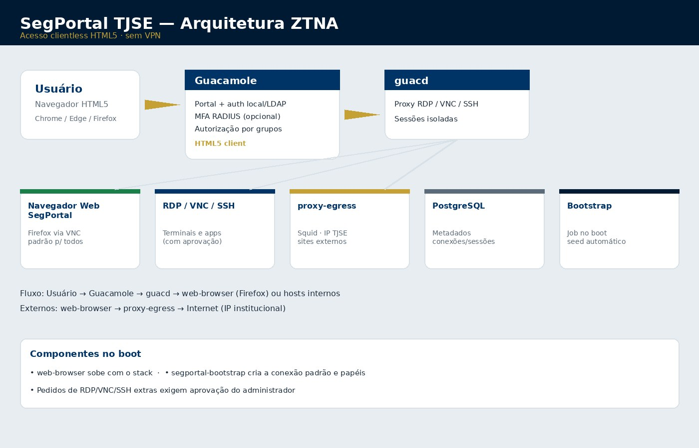
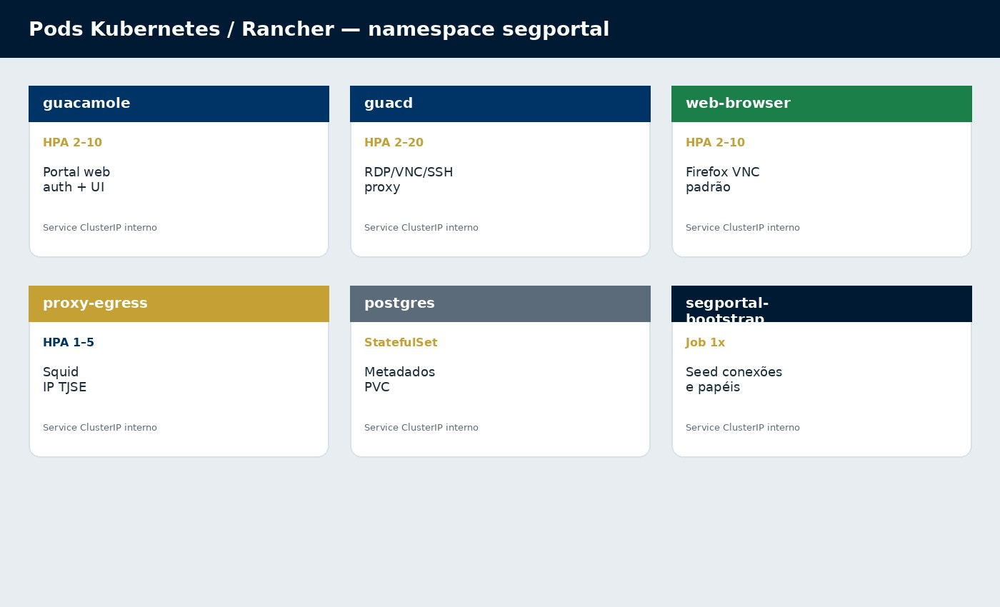
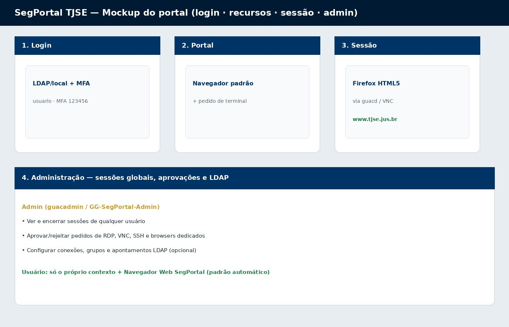

# Arquitetura — SegPortal TJSE

SegPortal implementa **ZTNA (Zero Trust Network Access)** para o TJSE com Apache Guacamole como portal clientless HTML5.

## Visão geral



| Componente | Função | Serviço / pod |
|------------|--------|----------------|
| **Guacamole** | Portal web, autenticação e autorização | `guacamole` |
| **guacd** | Proxy de protocolos RDP, VNC e SSH | `guacd` |
| **web-browser** | Firefox via VNC — navegador HTML **padrão** | `web-browser` |
| **proxy-egress** | Squid — HTTP(S) com IP institucional | `proxy-egress` |
| **PostgreSQL** | Metadados de conexões, usuários e sessões | `postgres` |
| **Bootstrap** | Seed idempotente: papéis + navegador padrão | `segportal-bootstrap` |

## Fluxo de autenticação


1. Usuário acessa o portal Guacamole
2. Autentica via **JDBC local** e/ou **LDAP** (`tjse.jus.br`), conforme configuração
3. MFA via **RADIUS** se `MFA_ENABLED=true`
4. Recebe conexões do seu perfil — no mínimo o **Navegador Web SegPortal**

## Deploy Kubernetes



| Workload | Escala típica |
|----------|---------------|
| `guacamole` | HPA 2–10 |
| `guacd` | HPA 2–20 |
| `web-browser` | HPA 2–10 |
| `proxy-egress` | HPA 1–5 |
| `postgres` | StatefulSet 1 |
| `segportal-bootstrap` | Job (uma execução por deploy/boot) |

## Mockup do portal



## Modularidade

```
segportal/
├── services/guacamole/     # Portal + entrypoint LDAP opcional
├── services/guacd/         # Daemon de protocolos
├── services/web-browser/   # Firefox (jlesage) via VNC
├── services/egress-proxy/  # Squid
├── scripts/bootstrap-segportal.sh
├── k8s/web-browser/
├── k8s/bootstrap/          # Job + ConfigMap de seeds
└── k8s/overlays/           # development / staging / production
```

## Decisões de design

| Decisão | Motivo |
|---------|--------|
| Guacamole 1.5.5 | Base estável com JDBC + LDAP oficiais |
| Navegador padrão no boot | Todo usuário navega sem VPN desde o primeiro login |
| Bootstrap automático | Elimina seed manual e drift de configuração |
| Pedidos com aprovação | Usuário não cria conexões sozinho |
| LDAP opcional | Homologação e emergência sem AD |
| Pods separados | Escala e blast radius independentes |
| Squid whitelist | Egress controlado no lugar da VPN HTTP |

## Referências

- [MANUAL.md](MANUAL.md)
- [CONNECTIONS.md](CONNECTIONS.md)
- [CONFIGURATION.md](CONFIGURATION.md)
- [DEPLOYMENT.md](DEPLOYMENT.md)
- [SECURITY.md](SECURITY.md)
