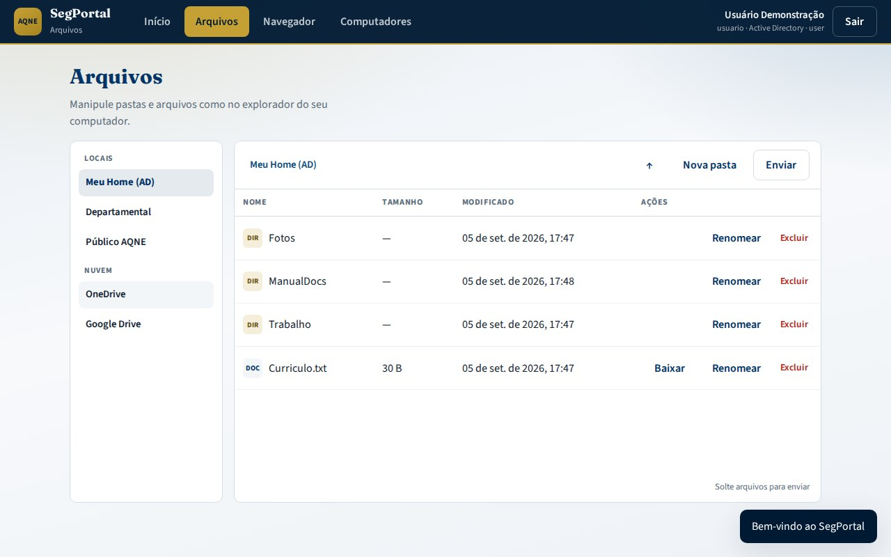
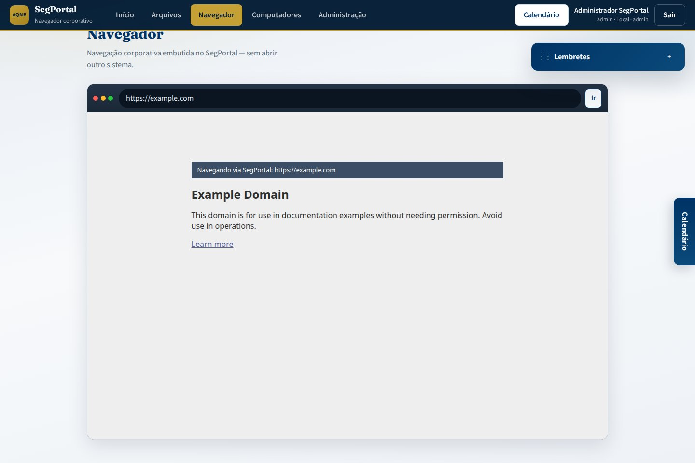
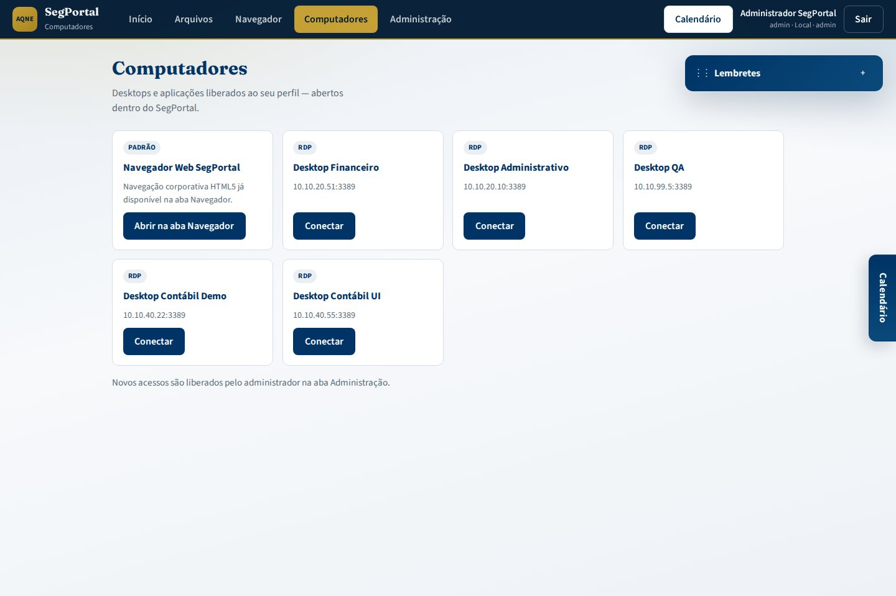
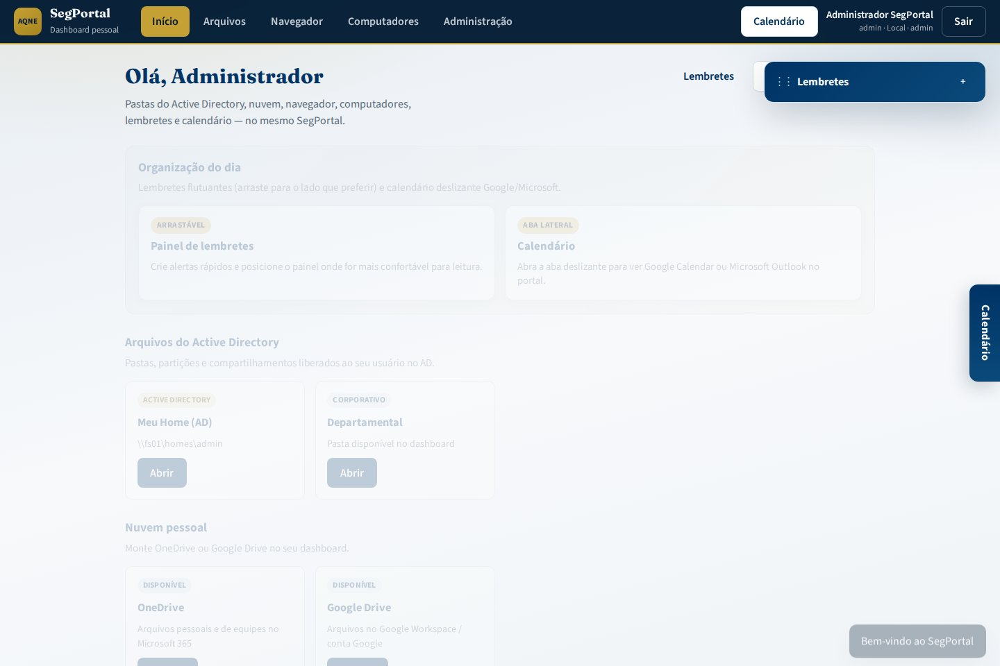
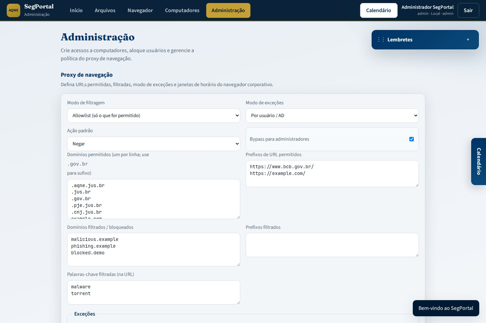

# Manual — SegPortal AQNE

Manual de referência do portal ZTNA do AQNE.

---

## Manuais por público

| Público | Documento |
|---------|-----------|
| **Usuário final** (passo a passo) | **[USER_MANUAL.md](USER_MANUAL.md)** |
| **Administrador** (operação e config) | **[ADMIN_MANUAL.md](ADMIN_MANUAL.md)** |
| Resumo visual | [USAGE.md](USAGE.md) |
| Arquivos AD / OneDrive / Google Drive | [FILES.md](FILES.md) |
| Navegador padrão e pedidos de terminal | [CONNECTIONS.md](CONNECTIONS.md) |
| Papéis admin / usuário | [ROLES.md](ROLES.md) |
| Admin local e LDAP opcional | [LOCAL_ADMIN.md](LOCAL_ADMIN.md) |
| Configuração técnica | [CONFIGURATION.md](CONFIGURATION.md) |

---

## 1. O que é o SegPortal?

O SegPortal permite acessar sistemas do AQNE e sites (internos e externos) **pelo navegador**, sem VPN. Inclui:

- **Dashboard pessoal** (`:8090`) — AD, OneDrive/Google Drive, gerenciador HTML, lembretes e calendário
- **Navegador corporativo embutido** — proxy autenticado com política administrável
- **Computadores** — acessos RDP/VNC/SSH alocados pelo admin a usuários locais ou AD
- **Administração** — criar computadores e gerir allowlist/filtros/exceções/horários do proxy
- **Sessões remotas** (stack SegPortal) — RDP, VNC, SSH e **Navegador Web SegPortal** (Firefox HTML5)


---

## 2. Acesso do usuário final

### 2.1 Login

1. Acesse **http://localhost:8090** (demo) ou a URL institucional.
2. Informe usuário/senha.
3. Marque **Active Directory** quando for conta de domínio (monta pastas liberadas).
4. Clique em **Entrar no portal**.


**Demo local**

| Papel | Usuário | Senha |
|-------|---------|-------|
| Administrador | `admin` | `admin` |
| Usuário | `usuario` | `usuario` |

### 2.2 Depois do login


| Recurso | Onde |
|---------|------|
| Pastas AD | Início → cartões Active Directory |
| OneDrive / Google Drive | Início → Nuvem pessoal |
| Gerenciador de arquivos | Aba **Arquivos** |
| Navegador HTML5 (proxy) | Aba **Navegador** |
| Computadores remotos | Aba **Computadores** |
| Lembretes / Calendário | Painel flutuante / aba lateral |
| Administração (admin) | Aba **Administração** |

Passo a passo completo: [USER_MANUAL.md](USER_MANUAL.md).

### 2.3 Arquivos



Listar, enviar (arrastar e soltar), criar pasta, renomear, baixar e excluir. Detalhes: [FILES.md](FILES.md).

### 2.4 Navegador Web SegPortal (ex.: Bacen)



Navegação embutida no portal com proxy autenticado. Exemplo: `https://www.bcb.gov.br/`. Ver [CONNECTIONS.md](CONNECTIONS.md) e [USAGE.md](USAGE.md).



---

## 3. Administração



| Tema | Documento |
|------|-----------|
| Contas locais / senha admin | [LOCAL_ADMIN.md](LOCAL_ADMIN.md) |
| Computadores + política de proxy (UI) | [ADMIN_MANUAL.md](ADMIN_MANUAL.md) |
| Shares AD, OAuth nuvem, API | [ADMIN_MANUAL.md](ADMIN_MANUAL.md) · [FILES.md](FILES.md) |
| Papéis e aprovações | [ROLES.md](ROLES.md) · [CONNECTIONS.md](CONNECTIONS.md) |
| LDAP, MFA, K8s | [CONFIGURATION.md](CONFIGURATION.md) · [DEPLOYMENT.md](DEPLOYMENT.md) |



---

## 4. Arquitetura (resumo)


| Componente | Porta | Função |
|------------|-------|--------|
| portal-auth | 8090 | Dashboard, arquivos AD/nuvem |
| sessions | 8080 | Sessões remotas |
| guacd | 4822 | Proxy RDP/VNC/SSH |
| web-browser | 5900 | Firefox VNC |
| postgres | 5432 | Metadados |
| proxy-egress | 3128 | IP institucional |

---

## 5. Início rápido

```bash
cd segportal
cp .env.example .env
docker compose up --build
```

- Dashboard: http://localhost:8090  
- SegPortal: http://localhost:8090  

Credenciais demo: `usuario`/`usuario` · `admin`/`admin`.
