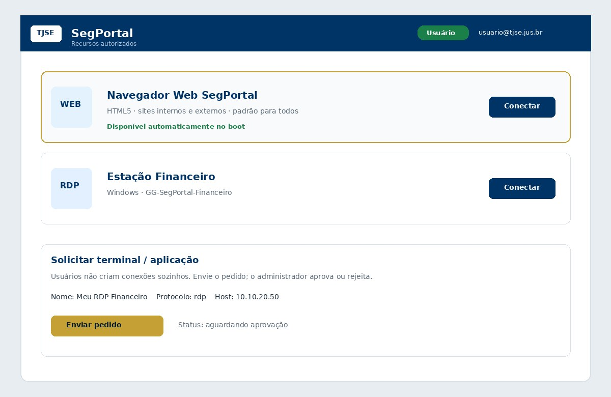
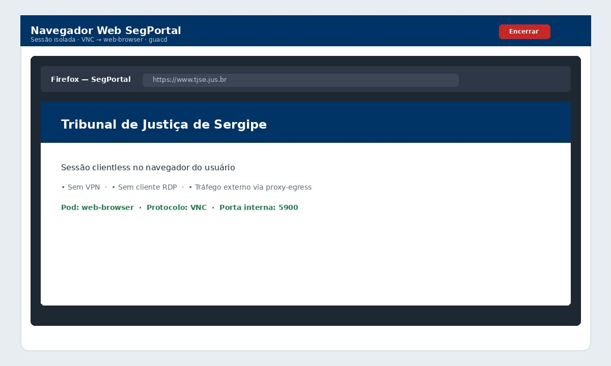
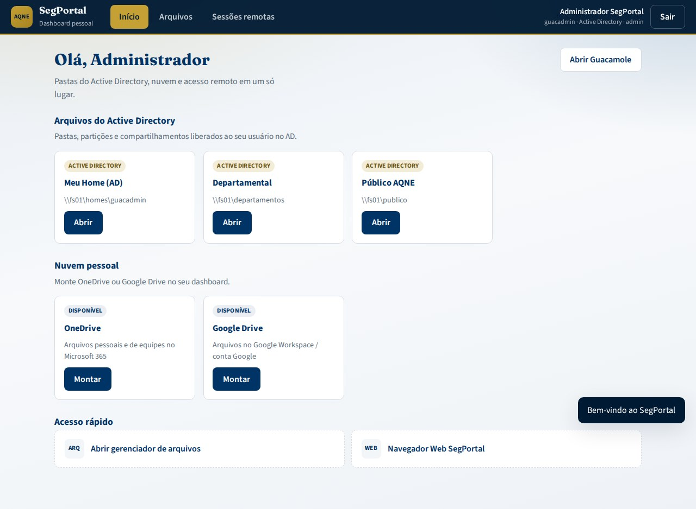

# Manual — SegPortal TJSE

Manual de referência para **usuários finais** e **administradores** do portal ZTNA do Tribunal de Justiça de Sergipe.

---

## 1. O que é o SegPortal?

O SegPortal permite acessar sistemas do TJSE e sites (internos e externos) **pelo navegador**, sem VPN nem clientes RDP/VNC. É um portal **clientless** baseado em Apache Guacamole, com autenticação local e/ou LDAP, MFA opcional e sessões isoladas por usuário.


**Destaque:** todo usuário autenticado já possui o **Navegador Web SegPortal** (Firefox via VNC → HTML5), habilitado automaticamente no boot do ambiente.

| Público | Documento |
|---------|-----------|
| Usuário final (passo a passo visual) | [USAGE.md](USAGE.md) |
| Arquivos AD, OneDrive e Google Drive | [FILES.md](FILES.md) |
| Navegador padrão e pedidos de terminal | [CONNECTIONS.md](CONNECTIONS.md) |
| Papéis admin / usuário | [ROLES.md](ROLES.md) |
| Admin local e LDAP opcional | [LOCAL_ADMIN.md](LOCAL_ADMIN.md) |
| Configuração técnica | [CONFIGURATION.md](CONFIGURATION.md) |

---

## 2. Acesso do usuário final

### 2.1 Como entrar no portal

1. Abra o navegador (Chrome, Edge ou Firefox atualizado).
2. Acesse: **https://segportal.tjse.jus.br** (produção) ou `http://localhost:8080/guacamole` (demo local).
3. Informe:
   - **Usuário** — login do domínio (`sAMAccountName`) **ou** usuário local
   - **Senha** — credencial do AD ou senha local
   - **Código MFA** — quando o MFA estiver habilitado no ambiente
4. Clique em **Entrar no portal**.


**Demo local (sem LDAP):**

| Papel | Usuário | Senha |
|-------|---------|-------|
| Administrador | `guacadmin` | `guacadmin` |
| Usuário | `usuario` | `usuario` |

### 2.2 O que aparece após o login

O portal lista apenas os recursos liberados ao seu perfil/grupo:



| Tipo | O que é | Observação |
|------|---------|------------|
| **Navegador Web SegPortal** | Firefox HTML5 | **Padrão para todos** — já liberado |
| **RDP** | Desktop Windows remoto | Mediante grupo ou aprovação |
| **VNC** | Desktop Linux remoto | Mediante grupo ou aprovação |
| **SSH** | Terminal de servidor | Mediante grupo ou aprovação |


### 2.3 Usar o Navegador Web SegPortal

1. Clique em **Conectar** em **Navegador Web SegPortal**.
2. O Firefox abre dentro do Guacamole (HTML5).
3. Navegue em sites internos do TJSE ou externos (externos saem pelo `proxy-egress` com IP institucional, quando configurado).
4. Ao terminar, **Encerrar sessão**.



### 2.4 Solicitar outro terminal ou aplicação

Usuários **não** criam conexões sozinhos. Para RDP/VNC/SSH adicionais:

1. Abra um pedido (script, chamado ou formulário do portal).
2. Informe nome, protocolo, host e justificativa.
3. Aguarde o **administrador aprovar**.
4. Após aprovação, a conexão aparece só para você.

```bash
./scripts/request-connection.sh usuario "RDP Empenho" rdp 10.10.20.51 3389 \
  "Acesso ao sistema de empenho"
```

Detalhes: [CONNECTIONS.md](CONNECTIONS.md).

### 2.5 Regras de sessão

| Regra | Valor padrão | Significado |
|-------|--------------|-------------|
| Timeout por inatividade | 60 minutos | Sessão encerra sem uso |
| Sessões simultâneas | Limitadas por política | Evita abuso de recursos |
| Isolamento | Por usuário | Ninguém compartilha sua sessão |

### 2.6 Problemas comuns (usuário)

| Sintoma | Possível causa | O que fazer |
|---------|----------------|-------------|
| Credenciais inválidas | Senha errada / conta bloqueada | Conferir senha; contatar TI |
| MFA rejeitado | Token expirado | Gerar novo código |
| Só aparece o navegador | Outros recursos ainda não aprovados | Solicitar terminal ao admin |
| Sessão cai | Timeout | Reconectar |
| Site externo bloqueado | Fora da whitelist do Squid | Pedir liberação à segurança |

---

## 3. Administração

### 3.1 Papéis

| Papel | Quem | Pode |
|-------|------|------|
| **Administrador** | `guacadmin` ou `GG-SegPortal-Admin` | Sessões globais, conexões, aprovações, LDAP |
| **Usuário** | locais ou `GG-SegPortal-Usuarios` | Próprios recursos + navegador padrão |



O admin **`guacadmin` / `guacadmin`** é criado no bootstrap e **não depende do LDAP**.  
Guia: [LOCAL_ADMIN.md](LOCAL_ADMIN.md) · [ROLES.md](ROLES.md).

### 3.2 Arquitetura e pods


| Componente | Função |
|------------|--------|
| `guacamole` | Portal web e autenticação |
| `guacd` | Proxy RDP / VNC / SSH |
| `web-browser` | Firefox via VNC (padrão) |
| `proxy-egress` | Squid — saída com IP TJSE |
| `postgres` | Metadados |
| `segportal-bootstrap` | Job/serviço que cria papéis + navegador padrão |

### 3.3 Autenticação


1. Credenciais locais (JDBC) **sempre** disponíveis.
2. LDAP/AD (`tjse.jus.br`) **opcional** — apontamentos pelo admin.
3. MFA RADIUS **opcional**.
4. Autorização por grupos Guacamole / AD.

### 3.4 Aprovar pedidos de conexão

```bash
./scripts/approve-connection-request.sh 1
./scripts/approve-connection-request.sh 1 --reject "Host fora da VLAN"
```

Ou pela UI administrativa (Settings → Connections) concedendo `READ` ao solicitante — preferir os scripts para auditoria.

### 3.5 Checklist de implantação

- [ ] Secrets/`.env` preenchidos (`POSTGRES_PASSWORD`, etc.)
- [ ] `docker compose up --build` **ou** `kubectl apply -k k8s/overlays/production`
- [ ] Job/serviço `segportal-bootstrap` concluiu com sucesso
- [ ] Login `guacadmin` e conexão **Navegador Web SegPortal** visíveis
- [ ] (Opcional) LDAP/MFA ligados e testados
- [ ] Whitelist do `proxy-egress` revisada
- [ ] Senha do `guacadmin` alterada em produção

### 3.6 Comandos úteis

```bash
# Demo local
docker compose -f docker-compose.dev.yml up --build

# Reaplicar bootstrap (idempotente)
./scripts/bootstrap-segportal.sh

# Kubernetes
kubectl -n segportal get pods,svc,ingress,job
kubectl -n segportal logs -l app=guacamole -f
kubectl -n segportal logs job/segportal-bootstrap
./scripts/validate-k8s.sh
```

---

## 4. Onde configurar cada item

| Necessidade | Documento |
|-------------|-----------|
| LDAP, MFA, proxy, variáveis | [CONFIGURATION.md](CONFIGURATION.md) |
| Deploy Rancher / Kubernetes | [DEPLOYMENT.md](DEPLOYMENT.md) |
| Segurança e auditoria | [SECURITY.md](SECURITY.md) |
| CI/CD | [CI_CD.md](CI_CD.md) |
| Preview interativo | [mockup/segportal-preview.html](mockup/segportal-preview.html) |

---

## 5. Suporte

Informe ao abrir chamado:

- Usuário afetado (`sAMAccountName` ou local)
- Recurso/conexão tentada
- Horário aproximado
- Mensagem de erro
- Se MFA foi solicitado

Contato: equipe de TI / infraestrutura do TJSE.
